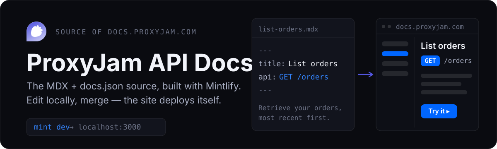

<p align="center">
  
</p>

<p align="center">
  <a href="https://docs.proxyjam.com"></a>
  <a href="https://github.com/getproxyjam/docs/actions/workflows/ci.yml"></a>
  <a href="LICENSE"></a>
</p>

Source for the [ProxyJam API documentation](https://docs.proxyjam.com), built with
[Mintlify](https://mintlify.com). Every page is an `.mdx` file; `docs.json` defines the
navigation tree, theme, and shared API settings. Changes merged to `main` deploy to the
live site automatically.

## Local development

You need [Node.js](https://nodejs.org) **v20.17.0+** and the Mintlify CLI:

```bash
npm i -g mint
```

Run a live preview from the repository root (where `docs.json` lives):

```bash
mint dev
```

The site opens at `http://localhost:3000` and hot-reloads as you edit. If your local preview drifts
from production, update the CLI with `mint update`.

## Project structure

```
.
├── docs.json     # Mintlify configuration: theme, navigation, API settings
├── overview/     # Getting-started and concept guides (.mdx)
├── api/          # API reference pages (.mdx), grouped by area (orders, wallet, …)
└── images/       # Logos and other assets
```

`docs.json` is the single source of configuration: site name and theme, color palette, the
navigation tree, and the API defaults (base server `https://api.proxyjam.com/public/v1` and
`X-API-Key` authentication) shared by every reference page.

## Editing and adding pages

Every page is an `.mdx` file that starts with frontmatter:

```mdx
---
title: "List orders"
description: "Retrieve your orders, most recent first."
---
```

API reference pages add an `api` field describing the operation. The server and authentication are
inherited from `docs.json`, so the playground works without repeating them:

```mdx
---
title: "List orders"
description: "Retrieve your orders, most recent first."
api: "GET /orders"
---
```

After creating a page, add its path (without the `.mdx` extension, e.g. `api/orders/list-orders`)
to the `navigation` tree in `docs.json` so it appears in the sidebar. Pages that aren't listed in
the navigation won't show up in the rendered site.

> **Provider neutrality:** this documentation is public. Describe mobile proxies as
> "mobile rotating" — never name the upstream infrastructure provider in any page.

## Validating your changes

```bash
mint broken-links     # report broken internal links
mint validate         # strict build check — fails on warnings or errors
```

`mint broken-links` accepts extra flags for deeper checks, for example
`mint broken-links --check-anchors --check-redirects`. CI runs `mint broken-links` on every push and
pull request to `main`.

## Deployment

Merging to `main` is meant to publish the site to
[docs.proxyjam.com](https://docs.proxyjam.com) automatically, with no manual deploy step.

**Verify that it did.** On 2026-09-02 the deployed site turned out to be built from
2026-06-08 — three months of merges that never shipped, including every page under
`/extension`, which is how a customer found a 404. Nothing warned anyone: the mirror push
succeeds, this repository's CI passes, and `mint broken-links` reports a clean source, because
none of them can see what the hosted site is actually serving.

The one check that catches it takes a second, and it compares the site with itself rather than
with the repository:

```sh
curl -s https://docs.proxyjam.com/sitemap.xml | grep -o '<lastmod>[^<]*' | sort | tail -1
curl -s https://docs.proxyjam.com/sitemap.xml | grep -c '<loc>'
```

The newest `lastmod` is the real build date, and the `<loc>` count should match the number of
pages in `docs.json`'s navigation. If the date is stale, the fix is not in this repository —
it is in the Mintlify dashboard: read the build log and reconnect the GitHub app to
`getproxyjam/docs`.

## Contributing

See [CONTRIBUTING.md](CONTRIBUTING.md) for the full workflow. Small fixes (typos, broken links,
clarifications) are very welcome.

## Security

To report a vulnerability in the API or platform, follow [SECURITY.md](SECURITY.md) — please don't
open a public issue.

## License

[MIT](LICENSE) © getproxyjam
